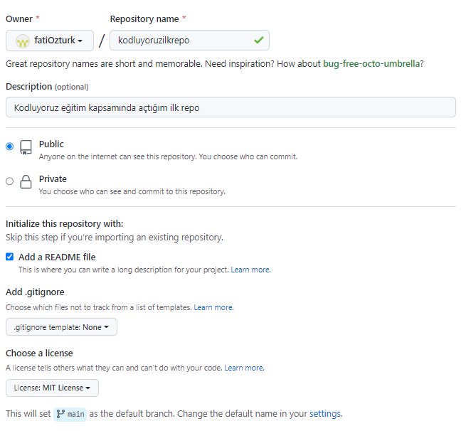

# kodluyoruz Ilk Repo
Bu repo [kodluyoruz](https://kodluyoruz.org/) Front-End eğitiminde oluşturduğumuz ilk repo. İçerisinde bir adet README dosyası, bir adet de index.html barındırıyor.

## installation
öncelikle projeyi clonlelayın.
```
https://github.com/fatiOzturk/kodluyoruzilkrepo.git
```
## Usage
Projeyi cloneladıktan sonra Visual Studio Code programında açınız.
Linux için:
```
cd kodluyoruzilkrepo
code . 
```
## Contributing
Pull requestler kabul edilir. Büyük değişiklikler için, lütfen önce neyi değiştirmek istediğinizi tartışmak için bir konu açınız.

## License
[MIT](https://choosealicense.com/licenses/mit/)